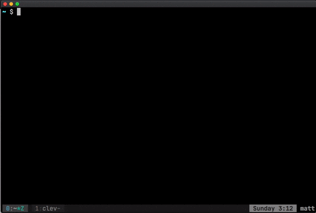

jump
===

`jump` is a utility to allow you to quickly jump to known location on your filesystem.



Installation
===

Installing `jump` is very easy: you just need to clone this very same repo at the latest release and then source the `j.sh` file in your bash profile. Here's how I do it in my [dotfiles](https://github.com/mattmezza/dotfiles) (see plugins.sh and plugins.txt).

```bash
git clone --branch 1.0.0 git@github.com:mattmezza/jump.git && source jump/j.sh
```
Usage
===

What follows is the output of `todo help`, accessible at any time.

```

Usage:
    j [OPT] ARGS

OPT:
    -r|--resolve
    -a|--add
    -l|--list
    -d|--delete
    -p|--db
    -h|--help
    -v|--version

Examples:
    $ j name         # to cd directly into 'name'
    $ j -r name      # to resolve 'name'
    $ j -a name path # to add 'name' as 'path'
    $ j -d name      # to delete 'name'
    $ j -l           # to list all entries
    $ j -h           # to print this message
    $ j -v           # to print the jump version
    $ j -p           # to print the path of the DB file
```

Development
===

Developing `jump` is quite easy. Clone the repo and start editing the `j.sh` file. You can always source your verions and test it in your shell.

